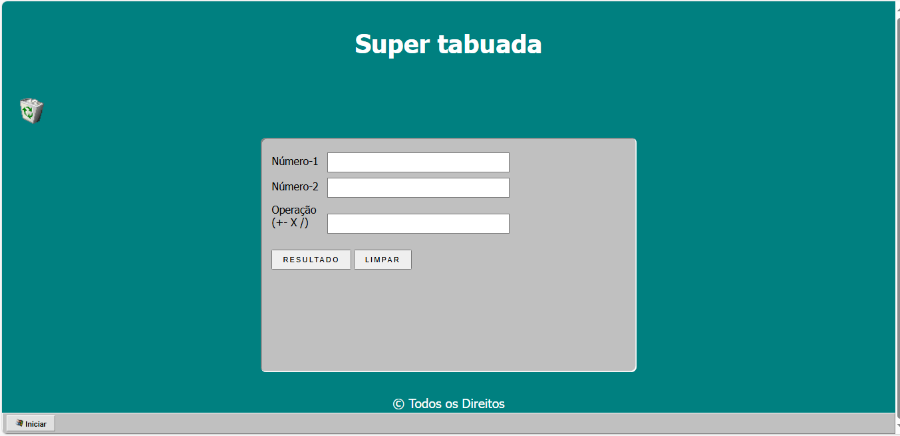

# 🖥️ Tabuada Estilo Windows 95

Um projeto simples e nostálgico desenvolvido com HTML, CSS e JavaScript puro.  
O objetivo é gerar a tabuada de um número digitado pelo usuário — tudo com visual inspirado no clássico sistema operacional **Windows 95**.  

---

## 🎯 Funcionalidades

- Entrada de número para gerar tabuada
- Botão para gerar tabuada de 1 a 10
- Botão para limpar campos e resultado
- Estilo visual retrô (bordas 3D, cores e fontes clássicas)
- Responsivo para desktop

---

## 🧪 Tecnologias Utilizadas

- HTML5
- CSS3 (sem frameworks)
- JavaScript (DOM, eventos, lógica de repetição)

---

## 📸 Captura de Tela

 

---

## 🚀 Acesse o projeto

🔗 [Clique aqui para ver online no GitHub Pages]([https://seu-usuario.github.io/tabuada-win95](https://jose35info.github.io/tabuada-windows95/)  

---

## 📁 Como usar este projeto localmente

1. Clone o repositório:
   
´´´
git clone https://github.com/seu-usuario/tabuada-win95.git

´´´

2. Abra o arquivo `index.html` em seu navegador

---

## ✍️ Autor

**Tony Gomes**  
📧 Contato: tony.manutencao@gmail.com
🔗 [LinkedIn](https://www.linkedin.com/in/seu-perfil) • [Portfólio](https://jose35info.github.io/Meu-Portfolio/)

---

## 🕹️ Curiosidade

> Este projeto foi inspirado no visual do Windows 95 para treinar lógica com JavaScript, manipulação do DOM e CSS 3D. Uma viagem ao tempo para quem começou a programar vendo computadores cinzas com fontes pixeladas!

---

## 📜 Licença

Este projeto está sob a licença MIT.

